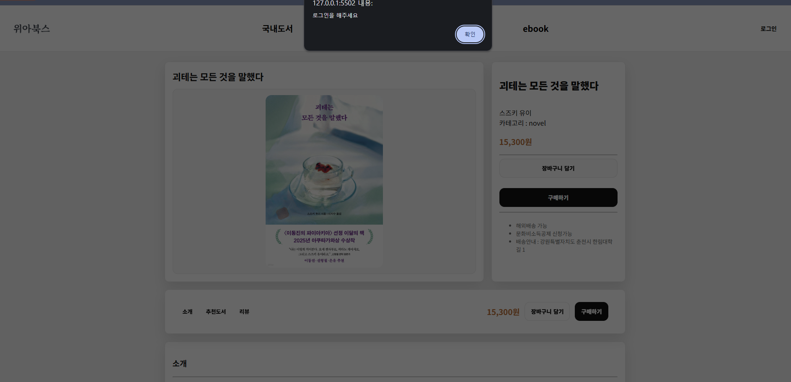

# 📚 WeAreBooks

기존 도서 사이트의 복잡한 정보 구조를 줄이고, 사용자가 원하는 도서를 더 빠르게 탐색할 수 있도록 설계한 도서 구매 플랫폼입니다.

검색 중심 사용자와 카테고리 탐색 사용자의 흐름을 나누어 메인 화면을 구성했습니다. 비회원도 서비스를 충분히 탐색할 수 있도록 페이지 접근은 유지하고, 구매·장바구니처럼 실제 행동이 필요한 기능에서만 로그인을 요구하는 기능 단위 접근 제어 방식을 적용했습니다.


---

## Links

- [📄 프로젝트 상세](https://app.notion.com/p/cf0b22d35981822e88d981029ff31073)
- [GitHub](https://github.com/mingyeong-seo/wearebooks)
- [회고](https://velog.io/@swmg00/%EC%9C%84%EC%95%84%EB%B6%81%EC%8A%A4-%ED%9A%8C%EA%B3%A0)

---

## 프로젝트 개요

| 항목 | 내용 |
| --- | --- |
| 프로젝트 | WeAreBooks |
| 유형 | 팀 프로젝트 |
| 기간 | 2026년 1월 13일 ~ 2026년 1월 23일 |
| 인원 | FE 4명 |
| 역할 | 메인/검색/장바구니 UI 구현, 사용자 흐름 설계 |
| 담당 페이지 | 메인, 검색, 장바구니 |
| 키워드 | UX, 기능 단위 접근 제어, LocalStorage, 상태 관리 |

---

## 기술 스택

| 분류 | 기술 |
| --- | --- |
| Markup | HTML5 |
| Styling | CSS3, Bootstrap 5 |
| Language | JavaScript (ES6) |
| Storage | LocalStorage |
| Tool | Git, GitHub |

---

## 문제 정의

프로젝트를 진행하며 아래 문제를 중심으로 화면과 기능을 설계했습니다.

- 기존 도서 사이트는 배너와 추천 콘텐츠가 많아 원하는 도서를 빠르게 찾기 어려웠습니다.
- 비회원의 페이지 접근 자체를 막으면 서비스 탐색 흐름이 끊긴다고 판단했습니다.
- 장바구니는 상품 수량, 선택 상태, 삭제, 주문 완료에 따라 데이터와 화면이 항상 같은 상태를 유지해야 했습니다.

---

## 서비스 흐름

검색형 사용자와 탐색형 사용자의 흐름을 분리하고, 회원/비회원 상태에 따라 구매 및 장바구니 이용 가능 여부가 달라지도록 설계했습니다.


---

## 담당 역할

### 메인/검색

- 검색 중심 메인 화면 UI 구현
- 카테고리 탐색 UI 구현
- 검색 결과 화면 구현
- 검색 결과에서 상세 페이지로 이동하는 흐름 구현

### 장바구니

- LocalStorage 기반 장바구니 상태 관리
- 상품 삭제, 수량 변경, 가격 계산 구현
- 체크된 상품 기준 합계 금액 계산
- 전체 선택/해제 기능 구현
- 주문 완료 후 선택 상품 제거
- 빈 장바구니/상품 존재 화면 분기 처리

### 서비스 설계

- 목적형/탐색형 사용자 흐름 설계
- 회원·비회원 기능 단위 접근 제어 설계
- 구매 과정의 화면 이동 및 상태 변화 로직 설계
- 메인 컬러 및 UI 스타일 가이드 정의
- 로고 및 파비콘 제작

---

## 주요 화면

### 메인 화면

검색과 카테고리 탐색을 함께 제공하여 목적이 명확한 사용자와 둘러보는 사용자가 각자의 방식으로 도서를 찾을 수 있도록 구성했습니다.


### 검색 화면

검색어와 일치하는 도서를 결과로 보여주고, 결과 선택 후 상세 페이지로 자연스럽게 이동할 수 있도록 구현했습니다.


### 장바구니 화면

선택된 상품을 기준으로 합계 금액을 계산하고, 수량 변경과 삭제가 즉시 화면에 반영되도록 구현했습니다.


### 비회원 로그인 유도

비회원도 상세 페이지까지 탐색할 수 있지만, 구매나 장바구니 담기처럼 행동이 필요한 기능을 클릭하면 로그인을 유도하도록 설계했습니다.



---

## 주요 구현 내용

### 1. 검색 중심 탐색 구조 설계

기존 도서 사이트는 배너와 추천 콘텐츠가 많아 목적이 명확한 사용자가 원하는 도서를 빠르게 찾기 어렵다고 판단했습니다.

이를 개선하기 위해 메인 화면에서 검색과 카테고리 탐색을 함께 제공했습니다. 사용자는 도서명을 알고 있을 때는 검색을 통해 빠르게 이동할 수 있고, 원하는 책이 명확하지 않을 때는 카테고리를 통해 도서를 탐색할 수 있습니다.

### 2. 기능 단위 접근 제어

비회원 사용자를 페이지 단위로 차단하면 탐색 흐름이 끊길 수 있다고 판단했습니다.

따라서 검색, 상세 페이지, 추천 도서 조회는 비회원도 이용할 수 있도록 유지하고, 구매/장바구니처럼 실제 행동이 필요한 기능에서만 로그인을 요구했습니다. 로그인 후에는 사용자가 보던 화면 흐름을 유지하고 상태만 변경되도록 설계했습니다.

### 3. LocalStorage 기반 장바구니 상태 관리

장바구니는 상품 추가, 수량 변경, 선택 상태, 주문 완료에 따라 데이터와 화면이 함께 바뀌어야 했습니다.

LocalStorage를 단일 데이터 소스로 사용하여 장바구니 상태와 화면을 동기화했습니다. 상품 수량 변경, 선택 상품 합계 계산, 전체 선택/해제, 주문 완료 후 선택 상품 제거까지 장바구니 상태 변화가 화면에 즉시 반영되도록 구현했습니다.

---

## 프로젝트 구조

```text
wearebooks/
├── assets/
├── project-root/
│   ├── assets/
│   │   ├── css/
│   │   ├── imgs/
│   │   └── js/
│   ├── components/
│   ├── pages/
│   └── index.html
└── README.md
```

---

## 실행 방법

별도의 서버나 빌드 과정 없이 브라우저에서 실행할 수 있습니다.

```text
index.html 파일을 브라우저에서 열기
```

VS Code Live Server를 사용하는 경우 `project-root/index.html`을 기준으로 실행하면 됩니다.

---

## 프로젝트를 통해 배운 점

이번 프로젝트는 HTML, CSS, JavaScript를 학습한 뒤 진행한 첫 팀 프로젝트였습니다.

화면을 구현하기 전에 사용자 흐름과 공통 규칙을 먼저 정의하는 과정이 이후 개발과 협업에 큰 영향을 준다는 점을 배웠습니다. 또한 LocalStorage를 화면 갱신의 기준 데이터로 활용하면서 데이터와 UI를 함께 관리하는 방식을 경험했습니다.

앞으로도 기능 구현 전에 사용자 흐름과 상태 구조를 먼저 설계한 뒤 구현하는 개발 방식을 이어가고자 합니다.

---

## 회고

프로젝트를 진행하며 사용자 흐름을 먼저 정의하게 된 과정과 개발 전에 공통 규칙, 협업 방식을 정해야 한다는 점을 회고로 정리했습니다.

- 사용자 흐름을 먼저 정리하며 기능을 구체화한 과정
- 공통 규칙을 미리 정하지 않아 겪었던 시행착오
- 협업 도구와 기록 방식의 중요성

[위아북스 회고: 개발보다 먼저 정해야 하는 것들을 배웠다](https://velog.io/@swmg00/%EC%9C%84%EC%95%84%EB%B6%81%EC%8A%A4-%ED%9A%8C%EA%B3%A0)
