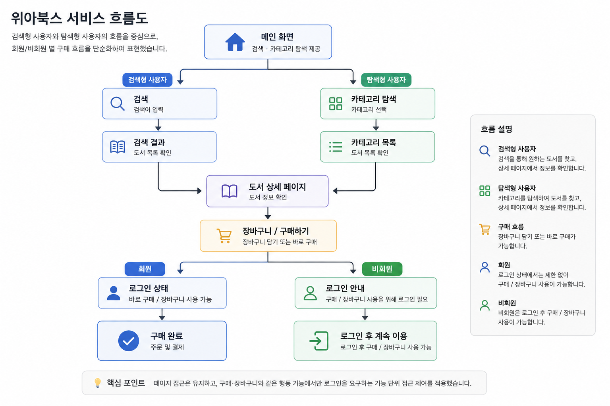
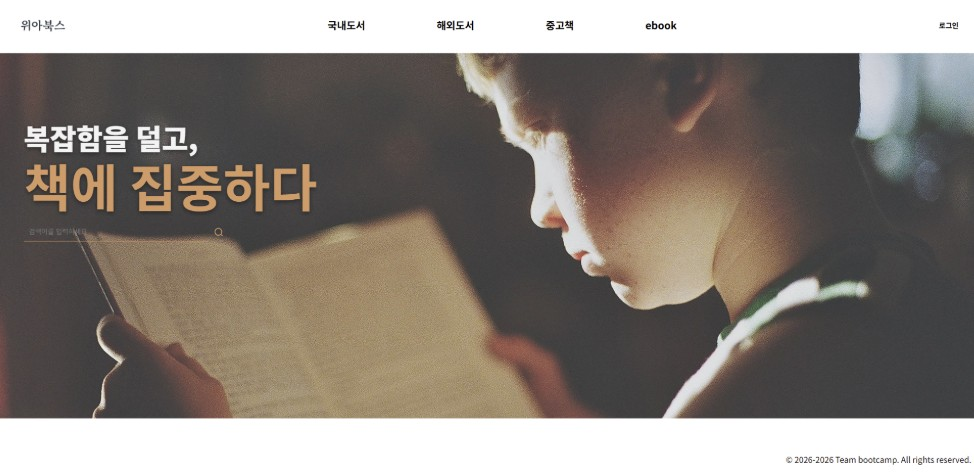
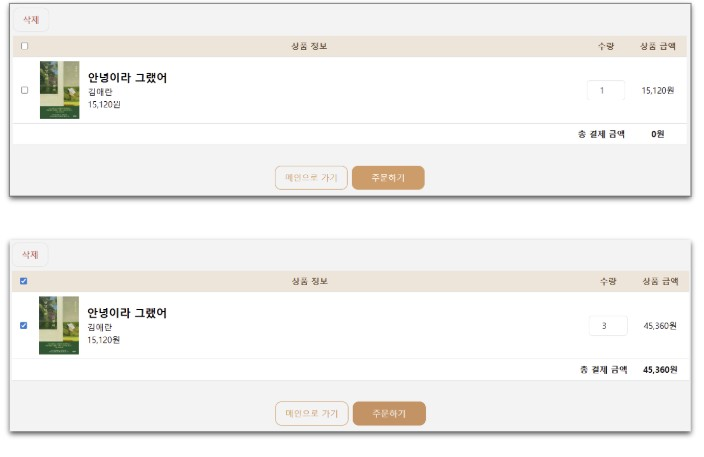

# 📚 WeAreBooks

사용자 행동 흐름을 기준으로 비회원/회원 접근 제어와 구매 과정을 설계하고 구현한 도서 구매 사이트입니다.
> 사용자 흐름을 기준으로 기능을 설계하고, 이를 실제 UI와 연결하는 데 집중했습니다.

---

## 📌 프로젝트 개요

- 사용자 유형을 "목적형(검색)" / "탐색형(nav)"으로 구분하여 설계
- 비회원은 탐색 가능, 행동(구매/장바구니/리뷰)은 제한
- 기능 단위 접근 제어 기반 UX 설계 적용
- 프로젝트 기간: 2026.01.13 ~ 2026.01.23 (10일)

---

## 🛠 기술 스택
- HTML, CSS, JavaScript

---

## 👥 팀 구성
- 팀원 A (본인): 메인/검색/장바구니 UI 구현, 사용자 흐름 기반 접근 제어 설계, 장바구니 기능 구현 (삭제, 수량 변경, 가격 계산), 주문하기 버튼 처리 및 구매 동작 흐름 구현
- 팀원 B: 도서 데이터 구성, 아이템(목록) 페이지 및 카테고리/베스트 도서 인터랙션 구현
- 팀원 C: 상세 페이지 및 추천 도서 기능 구현
- 팀원 D: 로그인, 마이페이지, 회원 정보 관리 기능 구현
  
---

## ⭐ 핵심 설계
### 1. 사용자 유형 기반 흐름 설계

- 검색 → 빠른 구매 흐름
- nav → 탐색 기반 이동

→ 두 흐름을 메인 화면에서 동시에 제공

---

### 2. 비회원/회원 기능 분리
- 비회원: 조회 가능 (검색, 상세, 추천)
- 회원: 구매, 장바구니, 리뷰 가능

→ 페이지 차단이 아닌 **기능 단위 제한 방식 적용**

---

### 3. UX 전략
- 버튼은 숨기지 않고 노출
- 비회원 클릭 시 → 로그인 유도
- 로그인 후 → 현재 화면 유지 + 상태만 변경

---

### 4. 장바구니 상태 기반 설계
- 비어있음 / 상품 있음 / 선택 상태 분리
- 체크된 상품 기준으로 가격 계산
- 수량 변경 시 즉시 반영

---

## 🧭 사용자 흐름

---

## 💻 구현 내용 (내 역할)
- 메인 화면 UI 구현
- 검색 기능 UI 및 결과 표시
- 장바구니 기능 구현 (삭제, 수량 변경, 가격 계산)
- 구매 및 장바구니 과정에서 사용자 행동에 맞춘 UI 및 화면 이동 로직 구현
- 기능 간 연결을 고려한 화면 구성 및 페이지 간 이동 구조 설계
- 사이트 메인 컬러 및 UI 스타일 기준 설정
- 로고 및 파비콘 제작

---

## 📷 주요 화면

### 메인 화면

### 검색 기능

### 장바구니

